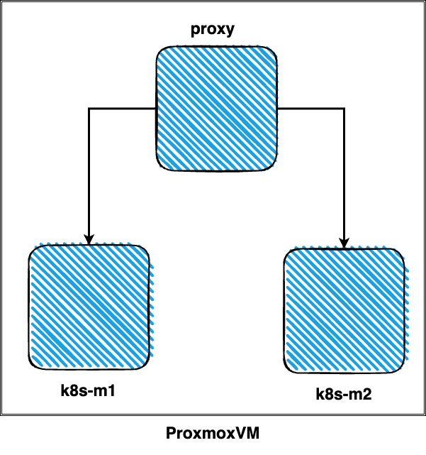

# Інструкція з встановлення кластера k8s на 2 вузли-майстри + HAproxy на сервер Proxmox VM

## Вступ

Цю інструкцію було вирішено написати для отримання досвіду роботи з Kubernetes і Ansible. Більшість знайдених інструкцій або вже застарілі, або містять помилки.

## Інформація про віртуальні машини

-   192.168.1.233 - proxy
-   192.168.1.230 - k8s-m1
-   192.168.1.231 - k8s-m2

## Підготовка шаблону для віртуальних машин

Встановлення віртуальних машин здійснюється шляхом клонування з готового шаблону. Вам необхідно заздалегідь підготувати віртуальну машину та конвертувати її в шаблон. Докладну інструкцію з створення шаблону віртуальної машини ви знайдете [тут](https://pve.proxmox.com/wiki/VM_Templates_and_Clones).

## Встановлення віртуальних машин

Для роботи з плейбуком на сервері з встановленою Proxmox VM вам потрібно встановити [proxmoxer](https://pypi.org/project/proxmoxer/).

Для встановлення виконайте команду:

    apt install python3-proxmoxer

## Структура файлу інвентаря

[pvenodes] - IP-адреса сервера Proxmox [k8s_master] - IP майстер-вузла VM [k8s_master2] - IP другого майстер-вузла VM [proxy] - IP VM HAproxy

## Структура файлу vm_vars.yml

-   proxmox_node - назва вузла Proxmox
-   proxmox_user - користувач root вузла Proxmox - приклад root@pam
-   proxmox_password - пароль користувача root вузла Proxmox
-   proxmox_bridge - ім'я мостового інтерфейса - приклад vmbr0
-   proxmox_host - IP-адрес вузла Proxmox
-   template_id - ідентифікатор шаблону для клонування віртуальних машин
-   cloudinit_user - ім'я користувача, яке буде створено на віртуальній машині
-   cloudinit_password - пароль, який буде створено для користувача
-   sshkey - SSH-ключ, який буде доданий при клонуванні віртуальної машини
-   vms - містить ID, ім'я і IP для створення віртуальних серверів

## Створення віртуальних машин

Для встановлення віртуальних машин запустіть плейбук `create_vms.yml` з вказанням файлу інвентаря inventory, а також вкажіть ім'я користувача root сервера Proxmox VM.

    ansible-playbook create_vms.yml -i inventory --user=root

Після запуску плейбука будуть створені віртуальні машини з налаштованою мережею та вказаним ім'ям користувача та паролем.

Для видалення всіх створених віртуальних машин використовуйте плейбук `delete_vms.yml`.

    ansible-playbook delete_vms.yml -i inventory --user=root

## Налаштування HAproxy

Встановлення та налаштування HAproxy здійснюється за допомогою плейбука `haproxy.yml`.

bashCopy code

    ansible-playbook haproxy.yml -i inventory --user=k8suser

### Ручне встановлення haproxy на віртуальну машину proxy

bashCopy code

    apt install -y haproxy

Відкрийте файл конфігурації haproxy `/etc/haproxy/haproxy.cfg` та додайте наступний текст в кінець файлу:

    frontend kubernetes-frontend
        bind *:6443
        mode tcp
        option tcplog
        default_backend kubernetes-backend
    
    backend kubernetes-backend
        mode tcp
        option tcp-check
        balance roundrobin
        server k8s-1 192.168.1.230:6443 check fall 3 rise 2
        server k8s-2 192.168.1.231:6443 check fall 3 rise 2

Запустіть haproxy, виконавши наступні 3 команди:

bashCopy code

    systemctl start haproxy
    systemctl enable haproxy
    systemctl restart haproxy

## Налаштування k8s-m1 та k8s-m2

На кожному з вузлів потрібно виконати наступні пакети:

-   apt-transport-https
-   ca-certificates
-   curl
-   gpg
-   kubelet
-   kubeadm
-   kubectl
-   containerd

Та налаштувати наступні параметри:

-   overlay
-   br_netfilter
-   net.bridge.bridge-nf-call-iptables = 1
-   net.bridge.bridge-nf-call-ip6tables = 1
-   net.ipv4.ip_forward = 1

Всі необхідні команди для виконання знаходяться у файлі `kubectl_config.sh`. Для налаштування всіх вузлів виконайте плейбук `install_kub.yml`.

    ansible-playbook install_kub.yml -i inventory --user=k8suser

## Налаштування кластера

Підключіться до першої майстер-ноди `k8s-m1` та створіть кластер, у `--control-plane-endpoint` необхідно вказати IP-адресу сервера proxy.

    sudo kubeadm init --control-plane-endpoint=192.168.1.243:6443 --upload-certs

На другій та наступних вузлах виконайте команду для додавання control-plane node.

Тепер ви можете приєднати будь-яку кількість вузлів control-plane, виконавши на кожному з них наступну команду як root:
    
    kubeadm join 192.168.1.243:6443 --token 87oixr.l8kinulpdnnsc1z2 \
    --discovery-token-ca-cert-hash sha256:6ddac82ec84248505e4314ce95c547e9d41cd403a8d3841ed2ae0e8b58a4ea76 \
    --control-plane --certificate-key 2f6df124ab30e6780770ae70ec42a588bdc5bf84494f928aa77fe1f8a1128147` 

## Налаштування kubectl

Для налаштування kubectl для отримання даних з нашого кластера виконайте наступну команду на одному з серверів кластера

    mkdir -p $HOME/.kube
    sudo cp -i /etc/kubernetes/admin.conf $HOME/.kube/config
    sudo chown $(id -u):$(id -g) $HOME/.kube/config

Якщо ви хочете отримувати дані про кластер на локальному комп'ютері, вам необхідно скопіювати файл `/etc/kubernetes/admin.conf` на локальний комп'ютер у папку `$HOME/.kube/config`.

## Перевірка стану кластера

Перевірте стан кластера, виконавши команду

    kubectl get nodes

Таким чином, налаштування кластера k8s з 2 майстер-нод завершено.

Щоб зробити наші вузли як майстер, так і робочими, виконайте наступну команду

    kubectl get no -o name | xargs -n1 kubectl patch --type=json -p '[{
    'op': 'remove',
    'path': '/spec/taints'
    }]'
    kubectl get no -o name | xargs -n1 kubectl patch -p '{
    "metadata": {
    "labels": {
    "node-role.kubernetes.io/control-plane": "true",
    "node-role.kubernetes.io/worker": "true"
    }
    }
    }'

## Тестування роботи кластера

Як базовий тест кластера та розуміння роботи проксі-портів для доступу до додатків, встановимо веб-сервер nginx.

На першій ноді встановимо мережевий плагін calico

`kubectl apply -f https://docs.projectcalico.org/manifests/calico.yaml` 

Встановимо nginx

`kubectl create deployment nginx-app --image=nginx` 

Тепер, якщо ми виконаємо команду `kubectl get pods`, ми побачимо, що у нас є розгорнутий pod nginx-app, і він запущений та працює.

У цей момент pod доступний лише у внутрішній мережі кластера. Щоб дозволити pod зовнішньо та зробити його доступним у публічній мережі кластера, виконайте наступну команду

`kubectl expose deployment nginx-app --type=NodePort --port=80` 

Щоб переглянути всі відкриті порти, виконайте команду `kubectl get svc`

    kubectl get svc

Порт, який був призначений нашому pod - 30809 Перевіримо, чи доступний pod за внутрішнім IP та портом

    curl http://10.104.151.153:80

Щоб отримати доступ до nginx, нам потрібно додати правила до haproxy. Підключіться до серверу proxy У файл конфігурації `/etc/haproxy/haproxy.cfg` додайте наступне

    frontend nginx
        bind *:80
        mode tcp
        option tcplog
        default_backend nginx_nodes
    
    backend nginx_nodes
        mode tcp
        option tcp-check
        balance roundrobin
        server k8s-1 192.168.1.240:30809 check
        server k8s-2 192.168.1.241:30809 check

Замініть порт 30809 на той, який буде наданий вашому pod, та IP-адреси серверів. Щоб нові правила набрали чинності, перезапустіть сервіс haproxy

    systemctl restart haproxy

Перейдіть у браузері за адресою [http://192.168.1.243:80](http://192.168.1.243/), замінивши 192.168.1.243 на адресу вашого proxy сервера, і ви побачите стандартну сторінку nginx.

На цьому налаштування кластера k8s для домашнього використання завершено.

## Додатково

Ви можете відредагувати плейбук під свої потреби, додавши до нього більше віртуальних серверів.